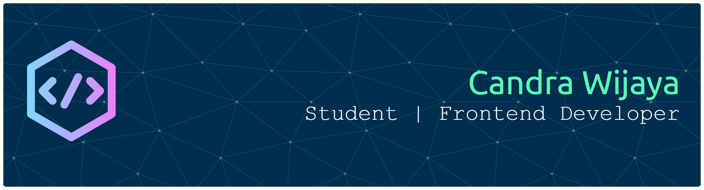

  

  <h1>Hi there, I'm Candra Wijaya! 👋</h1>
  
<b>Computer Science Student @ BINUS University</b>

  
  

    🚀 Passionate about building real-world applications & exploring new tech. 
    🎨 Love clean UI design, minimalist interfaces, and frontend engineering. 
    🐛 I actually enjoy debugging more than writing new code!
  

  

 

  

---

### 🌱 Current Focus
I am currently expanding my backend knowledge by learning **Go** and **System Design**.

 

---

### 🛠 Tech Stack

**Languages** 

**Frontend & Web** 

**Backend & Database** 

**Tools** 

---

### 📌 Featured Projects

### 📌 Featured Projects

| Project | Description | Stack |
| :--- | :--- | :--- |
| **JobPortal** | 💼 Full-stack job portal platform with secure authentication, role-based access, and database-level security using Row Level Security (RLS). | React, Tailwind, Vite, Supabase |
| **NutriCycle** | 🥗 Healthy catering marketplace mobile app with nutrition tracking features, built using native Android development. | Java, Android Studio |
| **Portfolio** | 🎨 Minimalist personal portfolio website showcasing projects and skills (Work in Progress). | React, Vite |

---

### 📫 Let's Connect

  
  

  

 

  <i>Thanks for stopping by! Feel free to check out my repositories.</i>

